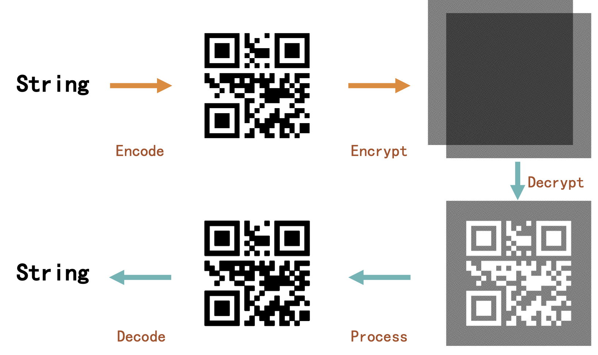

# Visual-Crypto-QR
**Visual cryptography implementation. Provide with QR code encode/decode pipeline.**

*This work is a part of course project of IS497, spring, 2020.*

## About

Visual cryptography implementation of string/QR code encoding/decoding, and image visual cryptography encryption/decryption. All functions can be used individually or as a pipeline.

Base on QR code, the project can encrypt/decrypt any string type messages. Also it can use visual cryptography feature solely to encrypt/decrypt images.



## Feature

* Use QR code to implement string encryption with visual cryptography.

* With QR code capacity and anti-noise characteristic to enhance visual cryptography performance.

* Post-process decrypted images to further improve image quality. 

## Usage

### QR Encode
 ```python
 import qr_coder
 def str2qr(string):
     qEncoder = qr_coder.qrEncoder()
     img = qEncoder.enc_str(string)
     img.save("./temp/msg.png")
     return img
 ```

### QR Decode
 ```python
 import qr_coder
 import cv2 as cv
 def qr2str(qr_path):
     qDecoder = qr_coder.qrDecoder()
     imgarr = cv.imread(qr_path)
     string = qDecoder.dec_str(qDecoder.process(imgarr))
     return string
 ```

### Image Encrypt
 ```python
 import visual_crypto
 from PIL import Image
 def qr2vc(qr_path):
     cryptCoder = visual_crypto.cryptCoder(path_dir='./temp/')
     # Get QR image
     img = Image.open("./temp/msg.png")
     cryptCoder.get_msg(img)
     # Generate secret and cipher image
     img_sct = self.cryptCoder.get_sct()
     img_cph = self.cryptCoder.get_cph()
     # Save or return
     img_sct.save("./temp/sct.png")
     img_cph.show("./temp/cph.png")
     return img_sct, img_cph
 ```

### Image Decrypt
 ```python
 import visual_crypto
 def vc2qr(img_sct, img_cph):
     cryptCoder = visual_crypto.cryptCoder(path_dir='./temp/')
     img_out = cryptCoder.get_out(img_sct, img_cph)
     img_out.save("./temp/out.png")
     return img_out
 ```
